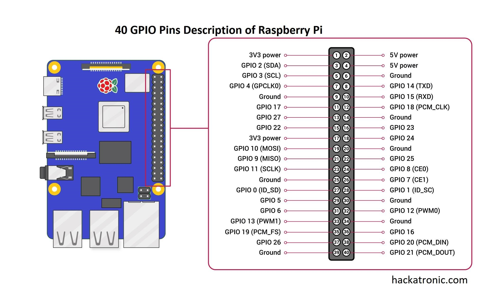

&nbsp;
&nbsp;
<p align="center">
  
</p> 

&nbsp;

# Arquitetura Embarcada com TinyML e Modelos Linguísticos para Monitoramento Veicular Inteligente

### ✍🏾Autores: [Rejanio Moraes](https://github.com/Rejanio), [Morsinaldo Medeiros](https://github.com/Morsinaldo), [Fellipe Milomem](https://github.com/Milomem), [Marianne Diniz](https://github.com/MarianneDiniz), [Ivanovitch Silva](https://github.com/ivanovitchm)

## 1. Resumo

A Internet das Coisas (IoT) no contexto automotivo impulsiona o desenvolvimento de soluções embarcadas que realizam inferência local e comunicação em tempo real. Nesse cenário, técnicas como TinyML, que executa modelos de aprendizado de máquina em dispositivos com recursos limitados, e Small Language Models (SLMs), que geram descrições interpretáveis localmente, ganham destaque. Este trabalho propõe uma abordagem embarcada em Raspberry Pi, integrando dados via protocolo OBD-II, GPS e acelerômetro a um pipeline de inferência contextual. A solução estima estilo de direção, emissão de $CO_2$, tipo de via e anomalias, usando um agente linguístico para relatar eventos detectados com baixa latência.


Este repositório contém o código fonte e materiais experimentais associados com o Agente Small Language Model (SLM) integrado com algoritmos de aprendizado online e embarcado em um Raspberry Pi 5 8 GB. Dentre os algoritmos, destacam-se o TEDA para detecção de outlier; MMCloud para classificar o comportamento do motorista; e dois modelos RandomForest para classificar o tipo de combustível (Gasolina/Etanol) e o tipo da via (Cidade/Rodovia).

Complementar, foi integrado ao algoritmo uma base de dados da Polícia Rodoviária Federal (PRF) com registros de Sinistros e Acidentes entre os anos de 2019 a 2024. Nesse sentido, caso o veículo esteja passando por pontos onda há registros de Sinistros ou Multas num raio de 500 metros, o agente irá informar isso para o condutor. Caso não existam, ele também irá informar.

## Estrutura do repositório 📂

 - accelerometer.py             - Código para processar dados do acelerômetro
 - acidentes_processado.csv     - Dataset processado de acidentes
 - agent_module.py              - Módulo principal do agente
 - consumption.py               - Cálculo de consumo de combustível
 - emissions.py                 - Cálculo de emissões
 - figures/                     - Pasta para armazenar figuras usadas no repositório
 - gps.py                       - Código para coleta e processamento de GPS
 - images/                      - Pasta para armazenar imagens geradas nos resultados
 - LICENSE                      - Licença do projeto
 - mmcloud_agent.ipynb          - Notebook do agente MMCloud
 - mmcloud.py                   - Implementação do algoritmo MMCloud
 - models/                      - Modelos treinados ou arquivos relacionados
 - multas_processado.csv        - Dataset processado de multas
 - obd_connection.ipynb         - Notebook para conexão OBD-II
 - obd_data_polo.csv            - Dados OBD coletados do veículo Polo
 - outlier_detection.py         - Código para detecção de outliers
 - README.md                    - Arquivo de documentação do projeto
 - requirements.txt             - Lista de dependências Python
 - start_app.sh                 - Script para iniciar a aplicação
 - tests/                       - Scripts de teste do projeto
 - websocket_obd_rasp.py        - WebSocket para comunicação OBD no Raspberry Pi

## Como executar? 🚀

### 1️⃣ Clone este repositório
```bash
git clone https://github.com/conect2ai/SBRT2025-MMCloud-Agent.git
cd SBRT2025-MMCloud-Agent
```
2️⃣ Instale as dependências

Recomenda-se utilizar Python 3.11+ com um ambiente virtual (venv ou conda):
```bash
pip install -r requirements.txt
```
3️⃣ Faça o download do modelo de linguagem

Devido ao tamanho, o modelo `Qwen2.5-0.5B.Q4_K_M.gguf` não foi incluído no repositório. Faça o download diretamente do Hugging Face:
```bash
https://huggingface.co/Qwen/Qwen2.5-0.5B-Instruct-GGUF
```
Salve o arquivo na pasta `models/` do repositório.


⸻

### Executando no Raspberry Pi 5

📍 **Especificações do hardware**

* Dispositivo: **Raspberry Pi 5**
* Memória RAM: **8 GB**
* Cartão SD: **mínimo 64 GB (recomenda-se 128 GB)**
* Sistema operacional recomendado: **Raspberry Pi OS (64-bit)**

📦 **Complementos utilizados**

* Módulo **GPS GT-U7**
* Acelerômetro **MPU6050**

---

### 🔌 Ligações no Raspberry Pi 5

<p align="center">
  
</p> 

As ligações foram feitas utilizando **jumpers fêmea-fêmea de Arduino**, conforme descrito abaixo:

**MPU6050 → (I2C)**

* VCC → 3.3V (pino 1) ou 5V (pino 2 ou 4) → verifique na placa GY-521
* GND → GND (pino 6, 9, 14, 20, 25, 30, 34 ou 39)
* SDA → GPIO 2 (pino 3)
* SCL → GPIO 3 (pino 5)

**GPS GT-U7 (usando UART)**

* VCC → 3.3V ou 5V (pino 1, 2 ou 4, dependendo do módulo)
* GND → GND (pino 6, 9, 14, 20, 25, 30, 34 ou 39)
* TX (do GPS) → GPIO 15 (RXD, pino 10)
* RX (do GPS) → GPIO 14 (TXD, pino 8)
* Taxa de transmissão → 9600 bps

---

### ⚙️ Configurações no Raspberry Pi

1️⃣ **Habilitar I2C (para o MPU6050)**
Execute:

```bash
sudo raspi-config
```

Navegue para:

```
3 – Interface Options → I4 I2C → Yes
```

2️⃣ **Habilitar UART (para o GPS GT-U7)**
Ainda no `raspi-config`:

```
3 – Interface Options → I6 Serial Port → 
Would you like a login shell to be accessible over serial? → No
Would you like the serial port hardware to be enabled? → Yes
```

3️⃣ **Instalar pacotes necessários**

```bash
sudo apt update
sudo apt upgrade
sudo apt install pps-tools gpsd gpsd-clients chrony i2c-tools python3-smbus
```

4️⃣ **Configurar arquivos**

* No terminal, execute os seguintes comandos para editar o arquivo `/boot/firmware/config.txt`:

```bash
sudo bash -c "echo '# the next 3 lines are for GPS PPS signals' >> /boot/firmware/config.txt"
sudo bash -c "echo 'dtoverlay=pps-gpio,gpiopin=18' >> /boot/firmware/config.txt"
sudo bash -c "echo 'enable_uart=1' >> /boot/firmware/config.txt"
sudo bash -c "echo 'init_uart_baud=9600' >> /boot/firmware/config.txt"
```

* Depois disso, execute o seguinte comandos para editar o arquivo `/etc/modules`:

```
sudo bash -c "echo 'pps-gpio' >> /etc/modules"
```

5️⃣ **Reinicie o Raspberry Pi**

```bash
sudo reboot
```

### 🛰️ Testar o GPS manualmente (opcional, mas útil)

Use os comandos abaixo para controlar e testar o GPS no Raspberry Pi. Eles ajudam a verificar se o dispositivo está enviando dados corretamente antes de rodar sua aplicação principal.

```bash
sudo systemctl stop gpsd
````

➡️ Para o serviço `gpsd` que pode estar rodando automaticamente em segundo plano, liberando a porta serial.

```bash
sudo systemctl stop gpsd.socket
```

➡️ Para o socket do `gpsd`, garantindo que nenhum processo esteja ocupando a comunicação com o GPS.

```bash
sudo gpsd /dev/ttyAMA0 -F /var/run/gpsd.sock
```

➡️ Inicia o daemon `gpsd` manualmente, especificando o dispositivo serial (`/dev/ttyAMA0`) e criando o socket em `/var/run/gpsd.sock` para os clientes se conectarem.

```bash
cgps -s
```

➡️ Abre uma interface em terminal que mostra as informações brutas do GPS, como latitude, longitude, altitude, número de satélites, velocidade, etc.

```bash
gpsmon /dev/ttyAMA0
```

➡️ Abre um monitor detalhado para ver os dados NMEA brutos vindos diretamente do GPS e monitorar pacotes em tempo real.


### 🔧 Conexão Bluetooth com o OBD-II

Além do GPS e do acelerômetro, o projeto utiliza conexão Bluetooth para coletar dados do veículo via OBD-II. Para isso, siga os passos abaixo:

1️⃣ **Pareie o adaptador OBD-II com o Raspberry Pi**

No Raspberry Pi, execute:

```bash
bluetoothctl
```

Dentro do prompt:

```
power on
agent on
scan on
```

Quando o dispositivo OBD-II aparecer (ex.: `OBDII 00:1D:A5:68:98:8B`), conecte:

```
pair 00:1D:A5:68:98:8B
connect 00:1D:A5:68:98:8B
trust 00:1D:A5:68:98:8B
exit
```

2️⃣ **Mapeie a porta serial Bluetooth**

Após parear, o dispositivo normalmente aparece como `/dev/rfcomm0`. Você pode forçar a criação desse link com:

```bash
sudo rfcomm bind /dev/rfcomm0 00:1D:A5:68:98:8B
```

3️⃣ **Teste a comunicação**

Use um programa como `minicom` ou `screen` para testar a comunicação:

```bash
sudo apt install minicom
minicom -b 38400 -o -D /dev/rfcomm0
```

4️⃣ **Configure sua aplicação para usar o OBD-II**

No código Python, aponte a biblioteca OBD (como `python-OBD`) para a porta:

```python
import obd
connection = obd.OBD('/dev/rfcomm0')
```
 > Você pode executar o notebook [obd_connection.ipynb](./obd_connection.ipynb)

### 🚀 Passo final

- Carregue o código no Raspberry Pi, execute:

```bash
bash start_app.sh
```


## 📜 Licença

Este projeto está licenciado sob a Licença MIT. Consulte o arquivo [LICENSE](LICENSE) para mais detalhes.

---

## 🌎 Sobre o Grupo Conect2AI

O grupo de pesquisa [**Conect2AI**](http://conect2ai.dca.ufrn.br) é composto por estudantes de graduação e pós-graduação da Universidade Federal do Rio Grande do Norte (UFRN). Nossa missão é aplicar Inteligência Artificial (IA) e Aprendizado de Máquina em áreas emergentes.

### 🎯 Nossas áreas de atuação incluem:

- **Inteligência Embarcada e IoT**: Otimização da gestão de recursos e eficiência energética para ambientes conectados.
- **Transição Energética e Mobilidade**: Uso de IA para otimizar o consumo energético de veículos conectados e promover uma mobilidade mais eficiente e sustentável.